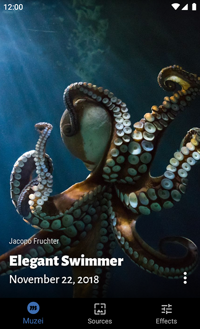
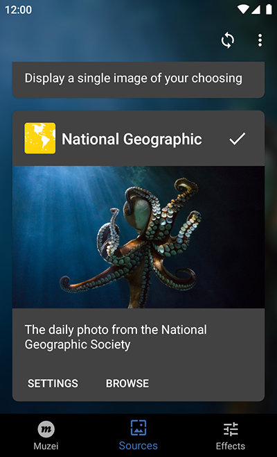
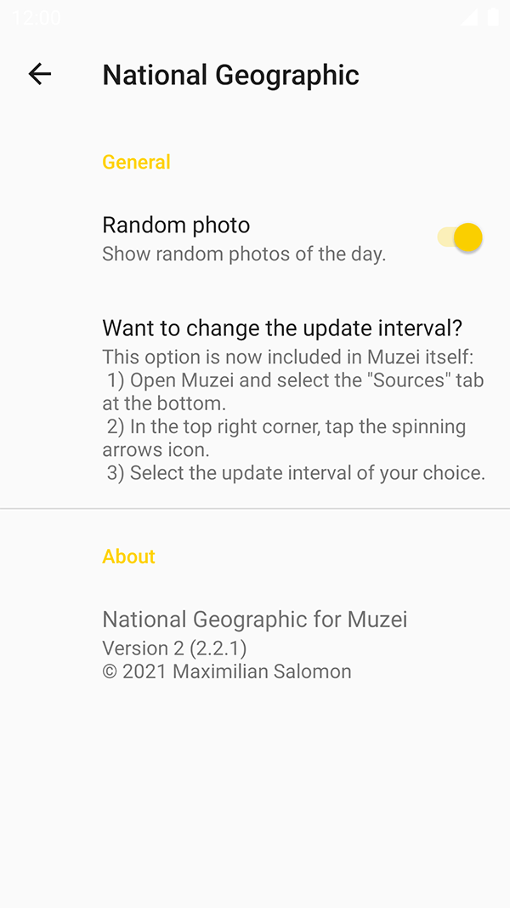

# National Geographic for Muzei

## About

**The National Geographic photo of the day for [Muzei](http://get.muzei.co/).**  
This is a plugin for the live wallpaper app _Muzei_ by Roman Nurik. It needs _Muzei_ to be used.

* Toggle between having always the **newest** photo of the day and showing **random** wallpapers.
* Read the **entire photo description** of the current photo within the app.
* **Share** your current photo with the world.

## Screenshots

   
   
   

## License

**Copyright 2014-2018 MSal**

This program is free software: you can redistribute it and/or modify it under the terms of the GNU General Public License as published by the Free Software Foundation, either version 3 of the License, or (at your option) any later version.  
This program is distributed in the hope that it will be useful, but WITHOUT ANY WARRANTY;
without even the implied warranty of MERCHANTABILITY or FITNESS FOR A PARTICULAR PURPOSE.
See the GNU General Public License for more details.  
You should have received a copy of the GNU General Public License along with this program. If not, see [http://www.gnu.org/licenses/](http://www.gnu.org/licenses/).
